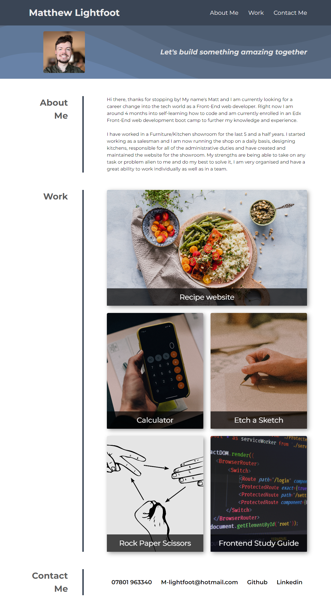

# matthew-portfolio

## Description

My motivation for this project was to utilize my knowledge of flex box, media queries, and CSS variables to create a portfolio of work where I can showcase my skills and talents to employers. I built this project to highlight my strongest work and also to have a place where someone can find all of my deployed applications on the one webpage. This solves a problem with having a lot of different links to various projects by having them all in the one place and also shows that I can optimize a webpage for different screen sizes.

## Screenshot

## Installation

N/A

## Usage

This portfolio website can be used to showcase what projects I have made and also let a potential employer read about me. You can click on the links in the header to take you to the relevant part of the webpage. You can also click on the various work pictures to take you to my various projects. You can also click on the contact information at the bottom of the page to contact me.

## Link

https://mtlightfoot.github.io/matthew-portfolio/

## Credits

N/A

## License

Please refer to the LICENSE in the repo.